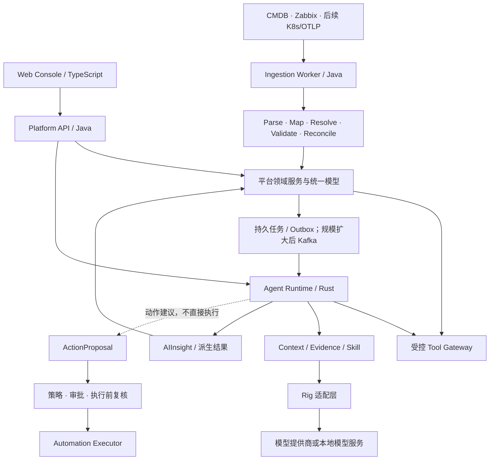

# OpsWeave（观织）总体架构设计 v4

> 文档版本：4.0.0 · 设计日期：2026-09-21  
> 产品：统一可观测与智能运维平台  
> 本次收敛：**Java 平台后端 + Rust Agent Runtime + TypeScript 前端**。不部署 Python Agent，不依赖 LangGraph；Python 仅可作为后续独立算法服务或当前可选开发校验工具。  
> 状态：架构基线与初始化模板。**设计范围不等于已实现功能**；代码完成度、实际执行的检查、未完成验证，分别见 `docs/IMPLEMENTATION-STATUS.md` 和 `docs/VALIDATION-REPORT.md`。

## 0. 关键决策

| 决策 | 本版确定的边界 |
|---|---|
| 产品与仓库名称 | OpsWeave / 观织，仓库 `opsweave`；v4 是文档版本，不写进仓库名 |
| 首个业务闭环 | CMDB/Zabbix → Entity/Metric/Alarm → Incident → 只读诊断 → 有证据的 AIInsight |
| 语言 | Java 管平台业务，Rust 管 Agent 执行，TypeScript 管控制台 |
| Agent 基础 | 采用 Rig；不从零实现模型协议、完整 Agent SDK 或通用工作流框架 |
| Agent 业务 | 自己实现 Context、Evidence、预算、授权边界、Skill 管理和诊断流程 |
| Tool | 内部受控领域 API 为主；MCP 是额外适配边界；不默认给 Shell、任意 SQL/HTTP |
| Skill | 第一版受控配置包，绑定预置 Rust 流程；不提供任意代码或容器上传 |
| 执行方式 | 固定流程优先；需要探索时有限轮次 Agent；专家团不是基础依赖 |
| 部署 | 逻辑领域模块化，先四个启动单元；不是一开始几十个服务 |
| 治理 | 多源 observation + 字段权威；Incident 聚合故障；证据与结果可追溯 |
| 可靠性 | 至少一次交付、幂等、对账、Outbox/Inbox；不声称跨系统 exactly-once |
| 默认安全 | 关闭未实现能力；Demo 必须显式启用，只读、回环地址、合成数据 |

**假设**：小团队、私有化优先、未来支持多租户；目前未提供真实吞吐、资源数、保留期、部署预算和可用性目标。本文的上限与容量公式用于规划，不构成性能承诺。高可用、生产安全、灾备和企业合规均须独立验收。

## 1. 总体架构与职责



图表示目标架构；模板里的 Rust Demo 使用 fixture，不会假装已经调用 Java 平台，也不返回“后台任务已受理”。

### 1.1 四个启动单元

| 启动单元 | 语言 | 当前与目标职责 |
|---|---|---|
| `platform-api` | Java | 控制面、领域 API、IAM、资源/故障、Tool Gateway、Skill 发布；模板业务接口默认拒绝访问 |
| `ingestion-worker` | Java | 采集、解析、映射、同步游标、对账；模板保留 SPI，真实采集器待实现 |
| `agent-runtime` | Rust | Agent/工作流、上下文、证据、Tool 调度、模型适配；提供本机只读 Demo 源码 |
| `web-console` | TypeScript | 模块化控制台与本机诊断表单；资产/故障业务 UI 待实现 |

对外统一走平台鉴权边界；正式部署不把内部 Runtime 裸露给浏览器。模板为本机开发提供 Vite 代理，不代表生产 BFF 已完成。

### 1.2 谁拥有数据

Java 的 `ai-control` 拥有 Skill 定义、发布版本、模型策略、预算配置；Rust 拥有 AIRun、StepRun、Checkpoint 等执行状态。最终 AIInsight 是平台业务资源，由平台验证、保存和授权访问。数据库可共用 PostgreSQL 集群，但 schema、角色和写入所有权必须分开，不能双方随意改同一张表。

## 2. 技术选型与版本策略

| 范围 | 选型 | 说明 |
|---|---|---|
| 平台后端 | Java 21 + Spring Boot 4.0.8 | 延续 v3 基线，不宣称是最新版本；4.x 的 Java/Gradle 要求参见 [S1] |
| Java 构建 | Gradle 8.14.3 | 初次生成真实 Wrapper；审查依赖锁与校验元数据 |
| Rust 服务 | Tokio + Axum 0.8.9 | I/O 并发与 HTTP 服务；不是 CPU 算法加速保证 [S2][S3] |
| 模型与 Agent | Rig 0.42.0，可选编译 feature | 使用 root `rig` facade，隔离框架类型；只锁直接版本还不等于锁完整依赖树 [S4] |
| MCP | 官方 rmcp 3.4.0，独立适配 | 模板仅有管理员本机 probe，未接入在线 Agent 工具集 [S5] |
| Rust 契约 | Serde / serde_json / jsonschema 0.56.0 | JSON Schema 运行时校验；禁用远程 schema 引用，防止隐式外连 [S6] |
| Rust 平台 HTTP 客户端 | reqwest，正式接入时增加 | 当前仅定义 `PlatformReadPort`，避免假实现一个成功返回的 HTTP 客户端 |
| Rust 持久化 | SQLx + PostgreSQL，后续任务 | 当前没有实现 RunStore；不能把 async 函数当成持久任务引擎 |
| 前端 | Zeus 0.1.1-beta.2 + Zeus UI 0.1.0-beta.4 + TypeScript 5.9 + Vite 8 | 原生 Web Components；pnpm-lock 固定。不走 React/Vue 包装 [S7][S8] |
| 图表/拓扑/流程编辑 | 按页面经适配层引入；默认不捆绑 React 组件库 | 产品层选型，逐项验收。ECharts / Cytoscape 等不是模板已实现功能 |
| 元数据 | PostgreSQL | 配置、身份、实体、关系、故障、Skill、执行元数据 |
| 指标 | VictoriaMetrics | 用 Metric API 隔离具体存储；小规模单节点，大规模评估 Cluster [S9] |
| 日志/分析 | ClickHouse，按需部署 | 不同时默认部署多套日志引擎 |
| 缓存 | Valkey，按需部署 | 不保存唯一一份运行状态；所有缓存必须带租户与权限边界 |
| Raw / Evidence 大对象 | S3 兼容接口 | 本地开发可使用文件适配；实现选型单独评估，不绑具体厂商 |
| 向量知识 | pgvector，知识库上线时增加 | 向量索引不是日志/指标主库 |
| 消息 | Lite 持久任务/Outbox；规模扩大后 Kafka | 同步查询不必绕 Kafka；高频遥测不都塞业务 Outbox |
| 部署 | Compose 开发；Kubernetes/Helm 目标 | 本模板不是生产 Helm chart；不默认上 Service Mesh |

### 2.1 Rig 与 rmcp 的兼容边界

Rig 0.42 区分 `rig-core` 的可移植协议/提供商能力、`rig-agent` 的执行能力，由 `rig` 统一导出。本次使用的是新 facade，而不是把旧版 `rig-core` 简单改别名。以**固定发布版本文档与编译结果**为准，不混用 `main` 文档的新 API。[S4]

模板不启用 Rig 内置的 `rmcp` feature；它依赖的 rmcp 主版本可能与独立 SDK 不同。外部 MCP 结果必须先转换成 OpsWeave Tool DTO，再通过统一授权和输出校验，不能直接把两套 SDK 的类型互传。

### 2.2 锁定策略

`Cargo.toml` 固定关键直接依赖；`Cargo.lock` 固定实际解析的完整图。模板未伪造 lockfile，也未随包带未经生成的 wrapper.jar。初次在可联网/有内部镜像的可信环境运行 bootstrap，生成并审查 Cargo、pnpm、Gradle 锁文件，然后固定已验证 Rust toolchain 精确版本与生产镜像 digest。当前 `rust-toolchain.toml` 的 `stable` 是 bootstrap 选择器，**不是可重现构建保证**。

生产 CI 必须使用 `--locked` / `pnpm install --frozen-lockfile`，检查来源、许可证、SBOM、漏洞和 SDK 升级后的契约回归。平台项目许可证尚未选择；模板不替用户决定开源或商业授权。

## 3. 模块化仓库与依赖规则

```text
opsweave/
├── apps/
│   ├── platform-api/             # Java 启动装配
│   ├── ingestion-worker/         # Java 采集进程
│   ├── agent-runtime/            # Rust 单 crate，内部按职责分层
│   └── web-console/              # Zeus / TypeScript
├── modules/                      # Java 领域模块
│   ├── shared-kernel/
│   ├── identity/
│   ├── catalog/
│   ├── inventory/
│   ├── integration/
│   ├── telemetry/
│   ├── alerting/
│   ├── incident/
│   ├── ai-control/
│   ├── automation/
│   └── audit/
├── contracts/                    # 跨语言协议唯一来源
├── extensions/                   # 版本化 Connector / Mapping / Skill / Policy
├── db/                           # SQL 原型，不自动当生产迁移运行
├── deploy/                       # Compose、Docker、部署约束
├── scripts/                      # 初始化与验证工具
├── tests/                        # 契约/架构/Java领域/场景
├── docs/                         # 主设计、ADR、运行手册、实现状态
├── Cargo.toml
├── settings.gradle.kts
├── package.json
├── pnpm-workspace.yaml
└── pnpm-lock.yaml
```

Java：`api → application → domain`，infrastructure 实现 application 定义的端口；domain 不引用 Spring、数据库驱动、HTTP 客户端或模型 SDK。跨域通过公开接口和事件通信，禁止随便访问其他领域的表。

Rust：`api / workflows / context / policies / ports / domain / adapters / skills`。`domain` 不引用 Rig、rmcp、Axum、SQLx。先一个 crate，出现多个二进制共享、发布边界或编译需求再拆，不为每个文件建 crate。

TypeScript：只依赖公开契约，不复用后端数据库实体。v1/v2 JSON Schema 共存且明确版本。代码生成可以添加，但不能把生成文件变成手工维护的第二套真相。

## 4. 领域数据模型

### 4.1 资源与身份

| 对象 | 含义与关键约束 |
|---|---|
| Tenant / Principal | 身份与租户由可信边界构造；不能接受 LLM 自报 tenantId |
| EntityType | 属性 schema、关系约束、身份策略；允许扩展但须版本化 |
| Entity | 平台 ID、类型、生命周期；不能使用 zabbix.hostid 作为全局主键 |
| ExternalObjectKey / ExternalLink | `(tenant, sourceInstance, externalType, externalId)` 唯一，防止不同 Zabbix 实例 ID 冲突 |
| Observation | 某来源在某时刻看到的属性值，包含 observedAt/ingestedAt、来源与质量 |
| FieldAuthorityPolicy | 按字段确定权威来源、过期窗口、冲突策略，不采用“最后写入者必胜” |
| Relation / RelationObservation | 有向关系、来源、有效时间、观察时间；保留历史拓扑 |

实体识别不能仅依赖 IP 或名字。优先使用明确作用域下的云实例 ID、K8s UID、可靠 UUID/资产标识；`Default string`、空 SN 等不当强 ID。IP 要带网络/租户/时间作用域。逻辑 Service 与物理 Host 是不同实体，不能因为同名合并。

低可信匹配进入人工处理；合并必须可审计、可纠正。某来源下线只改变其 Observation 的有效性，不直接删除其他来源仍确认的实体。实体软删除后历史 Metric、Incident、Evidence 仍可引用。

### 4.2 遥测

| 对象 | 关键内容 |
|---|---|
| MetricDefinition | 名称、单位、数值类型、Gauge/Sum/Histogram、单调性、temporality、适用实体、允许维度、聚合语义 |
| MetricSeries / MetricPoint | 定义版本、实体或资源属性、维度、时间、数值/分布、起始时间、来源 |
| LogRecord | eventTime、observedTime、body、severity、attributes、entityRef、traceId/spanId |
| Trace / Span | 跨服务追踪关系；第一阶段可只保留引用，后续接入 OTLP |
| DataQuality | 数据新鲜度、缺口、覆盖率、映射失败、时钟偏移、来源健康 |

标准化要保留指标语义，而不是只统一字段名。OTel 指标数据模型区分 Sum、Gauge、Histogram 及时间语义；适配时需要保留这些含义。[S10]

例：Zabbix `system.cpu.util[,user]` 是用户态 CPU 利用率，不等于整个 CPU 使用率。若内部标准采用 0–1，输入 0–100 时要显式 `/100` 并记录转换。Prometheus 的累计 CPU seconds 不能只改名字就当成百分比，需要正确的 rate、CPU mode 与聚合规则。

p95/p99 不能简单对多实例 percentile 求平均得到全局 percentile；应基于可合并分布或明确查询算法。发生 counter reset、NaN、缺失点、乱序点时有明确策略。摘要必须带采样区间、聚合粒度和覆盖率。

未解析实体的遥测可进入待关联区或暂以资源属性引用，不能为了补齐 entityId 随意创造并合并资源。

### 4.3 事件、告警、变更与故障

```text
Event：发生过的事实，原则上不可变。
AlarmRule：规则定义；AlarmInstance：一次告警生命周期。
AlarmTransition：触发、确认、恢复等变化。
Change：发布/配置/基础设施等变化，有前后版本和操作者。
Incident：一个故障处理对象，聚合多个 Alarm、实体、Change、Evidence 和 AIInsight。
```

不要把“Alarm 全部恢复”自动等同于“Incident 已解决”。维护窗口、静默、抑制与通知策略要区分；数据仍可保留，但默认不触发无限 AI 诊断。Zabbix trigger 是规则，不是告警实例；problem/recovery event 是生命周期事实，需要关联而不是各生成一个互不相干的告警。

### 4.4 AI 业务对象

| 对象 | 所有者/职责 |
|---|---|
| ToolDefinition | 版本化契约、effect、权限、资源选择器、实现状态、Capability、预算 |
| SkillDefinition / SkillVersion | 配置、工作流模板、工具白名单、Context 策略、发布审批 |
| Conversation | 最近对话与摘要，不等同于执行状态 |
| AIRun / StepRun | 任务状态、Skill digest、步骤、尝试次数、预算、结果引用 |
| Checkpoint | 可恢复状态、schema版本、租约 fencing token；不是 SDK 对象随便序列化 |
| ContextSnapshot | 本次模型实际看到的有限信息，以及 omitted/missing 项 |
| Evidence | 来源、权限、时间范围、可用时间、过期时间、摘要/原文引用与数据血缘 |
| AIInsight | 观测、候选解释、证据、缺口、限制；引用有效不等于结论属实 |
| ActionProposal | 修改动作建议、原因、证据、目标与预期结果；不包含可伪造的审批结论 |

不把模型自己报的 `confidence=0.95` 当成校准后的概率。证据强度、人工认可、预测校准等可以独立评估；无校准时只标明候选原因及证据缺口。

## 5. 多源接入与处理流水线

### 5.1 三条不同处理通道

```text
资产/配置：Connector → Raw → Parse/Map → Resolution → Observation → Entity/Relation 投影
高频遥测：Connector/OTLP → 类型/单位校验 → 轻量标准化 → 批写时序/日志存储
业务事件：Connector → Normalize → Outbox/Inbox → Alarm/Change/Incident 状态机
```

不要每个指标点都同步查 CMDB、运行实体合并、调用 LLM 或执行复杂 DAG。元数据缓存/映射表须带版本，按来源失效更新；热点链路做批量处理。

### 5.2 Zabbix 的适配

`host/item/trigger` 元数据与历史/事件数据通常需要分别获取并关联。`item` 不总是数值指标，日志、字符和文本应按类型路由。`history` 记录不能假设天然带 host、key、完整单位；具体版本 API 和返回字段以该版本 Zabbix 官方文档为准。[S11]

Connector 管认证、限流、分页、游标、快照完成标识、退避和可观测性；Mapping 管字段/类型/单位变换；Resolver 管实体身份；Writer 管领域幂等写入。单个 Connector 出错不应拖垮整个接入池。

### 5.3 配置与扩展

Mapping 声明式化，但不承诺任意数据源都无需代码。协议、分页、增量一致性仍可能需要新 Connector。管理员只能组合允许的解析与转换节点，不可在第一版上传任意脚本、SQL 或 Shell。

Pipeline v1 采用有界阶段链；少量路由/分支可以配置。不立刻开发通用 BPMN/无限 DAG。Connector、Mapping、目标 Schema、领域规则版本一起记录进 Lineage。

### 5.4 对账、删除、重放

增量同步 + 周期全量对账。只有完整、成功、具有足够权限的快照才能触发缺失判断；来源超时、鉴权失败、分页中断不能当“全部资源已删除”。先将来源观测标记为 stale，再按策略决定资源状态。

重放必须声明目的：修复规范化数据、重建投影或重新分析。默认禁用通知、自动动作和重复计费触发；记录 replayRunId、原流水线版本、新版本、dryRun 和影响范围。高频 Raw 是否全量留存按成本策略决定，不承诺所有数据无限保存。

## 6. AI 运行时：自研与现成组件的分工

```text
自己开发：
  Context 选择/压缩、Evidence、Skill 配置/发布、领域 Tool、授权、预算、Incident 用例、评测。

采用现成：
  Tokio/Axum、Rig 的模型/Agent 能力、rmcp 协议、Serde/JSON Schema、数据库客户端。
```

Rig 不替平台完成租户隔离，也不替你保证跨系统动作 exactly-once。Agent SDK 的 checkpoint 支持可复用，但持久存储、恢复校验、权限撤销和副作用对账仍属于 OpsWeave。模型上下文窗口也不是无限数据库。

### 6.1 推荐的执行方式

普通查询：确定性 API/Tool 直接返回。摘要：确定性查数 + 一次模型生成。标准诊断：预置工作流 + 并发采证 + 模型候选分析。深度调查：允许有限探索、附加 Tool 查询和逐步证据检查。只有确实需要隔离不同专业上下文时，才考虑多 Agent。

模板实现的是“标准诊断”最小骨架：

```text
可信 Demo 身份
 → 校验请求/权限
 → 并行 incident.get 与 metric.summary（合成适配器）
 → Context Pack
 → Mock 或可选 Rig 模型步骤
 → JSON Schema + 证据引用校验
 → 返回 RunResult（同步、不持久化）
```

没有生产鉴权、真实数据或持久化的能力一律不冒充完成。不开启 Runtime 时只提供健康接口；无配置时不自动选外部模型。

### 6.2 Framework Adapter

`ModelPort` 不暴露 Rig 类型；`PlatformReadPort` 不暴露 Java DTO/数据库对象；以后使用 rmcp 也先转成 ToolResult。ModelPolicy 是能力、预算、地域与租户准入策略，不是只有一个模型字符串。结构化输出、工具调用、流式响应等能力应由接入测试确认，不假定所有兼容接口行为一致。

模板提供 `rig-provider` feature，显式指定模型名和 API Key，并设置模型外连授权。默认 Mock 无付费请求；不得把 Mock 当真实模型故障后的隐式 fallback。

## 7. Tool 与 MCP

### 7.1 工具分层

| 层 | 示例 | 实现原则 |
|---|---|---|
| 原子领域 Tool | entity.get、metric.query、log.search | 权限、范围、返回上限、明确错误 |
| 语义 Tool | metric.summary、incident.context、topology.impact | 用确定性代码批查/聚合，减少模型轮次 |
| Action Tool | deployment.rollback、alarm.ack | 进入 ActionProposal 与审批，不直接执行 |
| 通用能力 | shell、任意 SQL、任意 HTTP | v1 不提供；后期沙箱也不能替代资源授权 |

Tool 数量不设拍脑袋上限，重点是可发现性、语义清晰、授权和单次暴露数量。第一版可从少量高价值只读工具起步。按 Skill 与当前权限筛选；搜索结果/向量检索只能召回候选工具，不能授予权限。

ToolDefinition 至少包含 id/version、input/output schema、effect、requiredPermissions、requiredCapabilities、resourceSelector、executor、deadline、maxResultBytes、实现状态与幂等语义。`registered` 不代表 `implemented`，更不代表当前用户 `authorized`。

### 7.2 每次调用的信任链

```text
模型/工作流提出调用
 → Schema 与输入上限
 → Skill允许工具 ∩ 主体权限 ∩ 租户策略 ∩ 资源授权
 → 并发/总预算/取消检查
 → Native API 或受控 MCP 适配器
 → 平台/上游再次鉴权
 → 输出校验、脱敏、时间/租户/资源范围检查
 → Evidence / Artifact 引用
```

Tool 输入不包含 tenantId、permissions、approvalStatus 等可信控制字段。Tool 返回 untrusted 数据，同样可能存在注入。MCP 的描述与只读注解不能视为安全证明。MCP 支持工具接口及 Schema，但业务许可必须由平台执行。[S12]

MCP server 准入、TLS、认证、跳转、外连目的地、凭据作用域、响应体限制和工具版本变化必须治理。不要把平台用户 Token 直接透传给任意 MCP 服务。模板的 probe 只用于显式管理员联调，既不执行 shell，也不对 Agent 暴露任意 URL。

## 8. Skill 平台化范围

### 8.1 第一版

内置 Skill + 复制修改、Prompt、输入输出 Schema、Context 需求、允许 Tool、知识范围、模型策略、预算、测试、版本、发布、禁用、运行记录。主要面向平台管理员，不把普通用户变成代码发布者。

Runtime 只执行预置模板，例如 `readonly-incident-diagnosis-v1`。管理员改 Prompt、预算、知识选择通常不需要 Rust 重新编译；增加新执行语义、Tool Executor 或工作流节点才需要发程序版本。

**模板当前实际支持**：启动时读取 `skill.json + prompt.md + output.schema.json`；变更配置后重启进程加载；内容生成 digest；路径校验、只读约束、严格工具集合、文件与预算上限。平台 CRUD、热更新、发布审批尚待开发。

### 8.2 版本与权限

已发布 SkillVersion 不可原地修改。运行开始固定 Skill、Prompt、模型策略和契约版本；后续发布不影响在途运行。禁用是阻止新任务，终止在途任务由显式操作处理。

Skill 声明所需权限，不能创造权限。缺少日志权限时明确数据缺口或拒绝该能力，不允许通过别的通用工具绕过。审批和测试环境应使用与生产相同的权限路径，但写动作默认禁用。

`SKILL.md` 是人类/Agent 可读说明，`skill.json` 是平台受控执行契约；不能仅靠 Markdown 指令授予代码执行能力。v2 才增加有限 DAG 编辑器；v3 才评估隔离插件 SDK/市场。

## 9. Context、时间与证据

### 9.1 六类信息分开

| 类型 | 内容 | 是否可直接信任 |
|---|---|---|
| System | 审核后的规则、输出约束 | 来自服务端，仍不能替代代码校验 |
| Principal | 租户、用户、资源权限 | 必须来自认证/授权系统，不让模型改写 |
| Task | 目标、窗口、问题、预算 | 输入要校验；实体歧义不可悄悄猜测 |
| Domain | 指标、日志、拓扑、告警、变更 | 不可信数据，具有来源/时效/权限 |
| Conversation | 最近对话、摘要、已确认事实 | 摘要会丢信息，不能成为事实的唯一来源 |
| Runtime | 当前步骤、工具结果引用、剩余预算 | 由执行引擎管理，不把模型隐含思考当状态 |

### 9.2 上下文构建

确定任务窗口和实体 → 按关系扩展有限范围 → 并行查数 → 排除不适用/越权/过期数据 → 聚合/抽样 → 排序 → 控制 Token/字节预算 → 生成 Snapshot。

权限是硬过滤，不是排序分数。查询失败、没安装日志、无权限、源延迟、确实没有异常是不同状态，不能统一返回空数组。跨租户数据返回是安全错误，不是普通缺口。

### 9.3 时间必须可解释

保存 eventTime、observedAt、availableAt/ingestedAt、builtAt。历史诊断的 `asOf` 是知识截止点；`builtAt` 是本次实际访问时间。历史证据不能因为 asOf 还没过期就忽略今天的过期策略。严格回测还须确认 evidence 当时已可获得；事后补录的 Change 不得泄露进“当时所知”的回测。

数据时钟可能偏移，校验和时序推断需要容忍度、质量标记和明确的排序规则；不能盲目把同一秒出现当成因果。所有存储和协议使用明确时区，展示按用户时区转换。

### 9.4 Evidence 对象

证据包含 ID、tenant/resource/incident scope、来源、查询参数摘要、采样窗口、观察/可用/到期时间、原文/结果引用、摘要、Lineage、访问策略版本。大结果放对象存储或原生查询系统，不塞进会话表。证据引用页仍然实时鉴权，不能因已经被 AI 引用就绕过访问撤销。

返回前再次校验证据存活与引用完整性。**存在这个 Evidence ID 只能证明引用对象存在，不证明该证据支持模型句子，更不证明根因。**产品要区分引用校验、证据支持检查、规则验证、人工确认。

RAG 用于 Runbook/SOP/故障案例等知识；实时指标走受控 API。RAG 检索也要带租户与文档 ACL。长期记忆只保存批准后的知识或稳定事实，不把一次推测自动写成永久知识。

## 10. 持久执行与分布式

### 10.1 目标状态机

```text
queued → running → succeeded / failed / cancelled
                 → waiting_approval → queued（恢复后重新鉴权）
```

AIRun 记录输入摘要、租户/用户、Skill digest、模型策略、截止时间、预算与结果引用。StepRun 记录每步输入/输出引用、重试和耗时。RunState 和 Conversation 分离。

持久任务需要：原子 claim、lease、heartbeat、fencing token、compare-and-set 状态更新、幂等键、失联回收与取消。旧 worker 丢失租约后不能继续提交结果。Rust future 取消只能取消本地等待，不保证模型提供商停止计费或远端动作没有发生。

### 10.2 交付语义

业务写入与 Outbox 在同一个事务提交；消费者 Inbox/幂等域键避免重复业务效果。批量指标写入按序列/时间/来源策略去重。Kafka partition key 选择实体/故障等稳定范围，不承诺全局顺序。

重放不能自动重复通知和副作用。Action 发出后超时进入结果未知状态，先查目标状态/执行记录再决定重试；不能把“没收到响应”当作“没执行”。

### 10.3 部署规模

| 模式 | 建议组件 | 启用条件 |
|---|---|---|
| 本机模板 | Rust Demo；可选 Zeus 页面 | 验证流程与契约；不需要数据库和模型 Key |
| Lite 产品目标 | Platform、Ingestion、可选 Runtime、PG、按需指标库 | 完成真实领域接口与持久任务后 |
| Standard | 多副本 API/Worker、持久队列、缓存、日志 | 有明确负载/故障隔离需求 |
| Large | 分区 Worker、Kafka、各存储 HA、区域/租户隔离 | 经过容量与故障演练，而不是简单增加 Pod 数量 |

本模板的同步 Demo **不能多副本恢复任务**。只有完成持久队列与租约后才可宣称分布式执行可用。Kubernetes HPA 以可持续服务量、队列滞后和依赖压力综合决策，不只看 CPU。

## 11. AI 如何进入指标体系

源指标、派生指标、模型结果共用指标目录，但语义不能混淆。

- 异常分数/基线偏差：可以成为有定义的数值指标，带算法和版本。
- 预测：记录 `issuedAt / targetTime / horizon / modelVersion / interval`；不同发布时间的同一目标预测不能覆盖为一个点。
- 根因候选/解释：进入 AIInsight，不伪装成 Metric。
- 状态变化：进入 Event；告警由明确规则触发，不把所有 AIInsight 直接当 Alarm。

不把原值与预测写到同一序列，也不把异常分数当故障概率。预测区间/校准方法若没有就不伪造。模型版本通常放受控元数据或有限标签，不把 runId、prompt全文、日志原文作为时序标签制造基数爆炸。

避免 AI 反馈环：每个派生结果记录 producer、lineage、cause/run ID、generation depth。AI 默认不递归消费自己刚生成的告警/结果；有意启用时设置深度和速率限制。

## 12. 性能、成本与退化

主要优化方向是减少无意义模型往返、限制查询量、并行取数、确定性聚合与控制上下文。Rust 运行时适合做受控 I/O 并发，但并不自动加速远程模型；Tokio 也不是通用 CPU 密集计算调度器。[S2]

模板初始上限：全局 4 个并发诊断、单任务 30 秒、2 次预置 Tool、一次模型步骤、Context 16 KB、请求体 16 KB、模型原始结果 32 KB。这些是**防失控配置**而非性能实测。正式产品按 tenant、model、tool、source 多级限流，并设置有界队列。

服务端做聚合、日志模式提取、窗口比较；LLM 负责解释和探索。时间序列采样保留异常峰值，不用盲目抽样制造“看起来正常”。Context 预算应优先保留关键证据和数据缺口，裁剪要可观察。

缓存 key 至少包括 tenant、principal/resource authorization scope、查询参数、截止时间、schema/策略版本；权限撤销和来源更新需要失效。不能把跨租户摘要缓存共用。查询缓存不能把失败结果长期伪装成“无告警”。

压力下优先处理告警/状态变化与关键指标，低优先日志允许明确采样/降载；所有丢弃有计数。外部模型不可用时，可以返回确定性摘要或证据包，但必须说明模型未完成分析；不能悄悄显示成功的 AI 根因结论。

容量估算：

```text
每日指标点 ≈ 活跃序列数 × 86400 / 采样间隔秒
Raw容量 ≈ 平均每日压缩写入量 × 保留天数 × 副本/冗余系数
模型费用 ≈ 各模型实际输入/输出 Token × 当前合同单价
运行并发 ≈ 平均到达率 × 平均执行时间（用于初始估算，需压测验证峰值）
```

不按模板给定“几台机器即可支撑十万主机”。记录每租户/Skill/Run 的查询量、字节、Token、模型成本与重试成本。

## 13. 安全与受控自动化

平台必须在 API、领域、查询、对象存储、向量检索、缓存、执行状态、审计中保持租户边界。PG RLS 可以作为纵深防护；特权角色、表 owner 与 `BYPASSRLS` 等行为需要明确处理，不能让生产应用用迁移/管理员角色运行。[S13]

Secret 存 Vault/KMS/受控 Secret Store，配置只保留 secretRef。不要把模型 API Key、数据源密码写进前端、日志、Prompt、Tool 输入或 Skill 包。即使使用 K8s Secret，仍需要 RBAC、加密和轮换策略。

Prompt Injection 来自用户、日志、知识文档和工具响应。系统通过不可信数据标记、受控工具、授权、输出限制和审批降低风险，不能宣称加一句“不要相信日志”即可消除注入。输出不执行 HTML/Markdown 内的脚本，不把内容当命令解释。

动作链：`Proposal → Policy → Approval → 执行前权限/资源版本复核 → Executor → 结果验证 → 补偿/人工升级`。审批绑定明确动作参数、目标与有效期；参数修改后审批失效。Rollback 不是所有动作的自动可逆保证。

高风险通用执行后期必须进隔离 executor，限制网络/文件系统/CPU/内存/时间和凭据；Native Agent Runtime 不执行任意子进程。不向普通 Skill 暴露 `curl`、数据库 Shell、任意 `kubectl` 逃生口。

## 14. 可观测性、质量与评测

平台自身至少观测：采集延迟、来源最后成功时间、丢弃/重复/失败率、对账完整度、写入错误、队列 lag、任务等待/执行时间、Tool 错误、模型调用、结构化输出失败、引用校验失败、越权拒绝、预算耗尽。

日志默认仅记录 runId/step/tool/status/耗时等元信息，不记录 Token、完整 Prompt、原始日志或密钥。原文排障需单独权限与保留期。UI 可以展示工具步骤、证据和结果，不能承诺暴露模型内部隐含思考过程。

评测包含：契约测试、跨租户负例、故障恢复、只读约束、过期证据、时间泄漏、重复消息、模型输出格式与错误引用、历史 Incident 回放、人工认可与漏报。LLM-as-judge 只能作为辅助，不替代固定标注集和人工确认。

多 Agent 只有在固定预算下实测改善质量或覆盖范围后才引入；增加“专家人数”不等于准确率增加。

## 15. 前端与按需能力

产品模块：资源、拓扑、指标、日志、告警、Incident、变更、数据接入、Skill、模型、运行记录、知识库、设置。按路由懒加载；第一版无需微前端。

Capability 表示模块安装/依赖是否满足；Feature Flag 表示租户/用户是否启用；Permission 表示是否有权使用；Readiness 表示当前是否可服务。这四个概念不能压成一个布尔值。前端隐藏菜单不等于后端授权完成。

AI 工作台应展示：目标与时间窗口、步骤状态、证据可点击回查、候选原因、明确缺失数据、模型/Skill 版本、耗时/费用、取消与人工反馈。Skill 编辑界面再增加版本 diff、测试输入、失败记录与发布；不在第一版做万能编程 IDE。

模板只提供本机诊断表单和未实现模块提示；连接的是 Vite dev proxy → 本机 Rust Demo。静态 Nginx 镜像不自动建立生产 API 代理。控制台实现为 Zeus + Zeus UI 原生组件，见 ADR-012。

## 16. 数据保留、灾备与升级

Retention 按租户和数据类型配置：源 Raw、完整日志、细粒度指标、聚合指标、Incident、AI上下文、证据原文、摘要与审计可不同。选择期限要结合合同与成本，不能照搬一个固定天数。删除必须覆盖对象存储、搜索索引、向量、缓存和派生结果；法律保留/客户保留要求需显式冲突处理。

降采样不是简单平均所有指标：counter/histogram/percentile 要有对应语义。历史关系、实体软删除与 Source mapping 变化要能够解释历史查询。

数据库备份、对象存储备份/版本保护与恢复演练，分别定义 RPO/RTO。Schema 升级采用兼容字段、双读/双写过渡与回滚计划；in-flight AIRun 必须绑定可恢复的 Schema 与 Skill/SDK 版本。部署前先检查兼容性，不能升级后再碰运气反序列化 checkpoint。

插件升级有兼容范围、来源校验、签名策略、健康检查和回退。关闭插件时有任务排空与故障说明，不把任务永远挂起。

## 17. 本次模板交付的真实范围

| 内容 | 状态 |
|---|---|
| Java 模块边界、领域值对象、Connector SPI、领域 smoke | 有源码；依赖无关部分可本地验证 |
| Spring Boot 启动服务 | 有配置；业务默认 deny-all；完整依赖构建需验证 |
| Rust HTTP / Mock / Context / Skill / 引用校验 | 提供实现源码与测试；交付环境没有 Cargo，未执行 Rust 编译和测试 |
| Rig 模型适配 | 可选 feature 源码，显式外连开关；未编译、未付费调用 |
| MCP | 独立本机探测示例；未在线集成、未联调 |
| 前端 | 有诊断表单、开发代理和模块占位；完整 pnpm 构建需验证 |
| 真实 CMDB/Zabbix 数据、平台授权、Tool HTTP | 待开发，不静默回退 fixture |
| RunStore/Checkpoint/分布式 Worker | 状态设计与 SQL 原型，执行实现待开发 |
| Skill UI/发布、向量知识、自动化、生产 Helm | 待开发 |
| 锁文件/Wrapper | 必须在可信初始化环境真实生成并提交；未伪造 |

因此本模板是“有代码与契约的起点”，不是一套交付即生产上线的系统。技术选型已收敛；实现进度如实标注。

## 18. 实施顺序与验收点

**P0 初始化**：生成依赖锁和 Wrapper；格式化并编译 Rust 所有 feature；构建 Java/前端；完成静态和负例测试。先解决构建，不急着堆功能。

**P1 真实数据闭环**：OIDC/tenant/resource scope → CMDB/Zabbix Host → Observation/ExternalLink/Entity → MetricDefinition 与规范化数据 → Alarm/Incident。验收同实体跨来源映射、来源失败不误删除、单位转换与重复事件。

**P2 只读 AI 闭环**：Java Tool Gateway → Rust HttpPlatformReadPort → Context/Evidence → 单次模型摘要 → 平台保存 AIInsight。验收越权、证据过期、来源失败和输出校验；UI 必须可点击证据。

**P3 平台化 Skill**：CRUD、immutable version、测试集、发布、禁用、内容 digest、预算策略。Rust 只加载已授权/已发布包；不读任意用户路径。

**P4 可靠执行**：AIRun 持久化、租约、故障恢复、Outbox、取消、重放、上下文缓存与权限失效。验收 kill worker、超时、重复投递、恢复后授权撤销。

**P5 算法与预测**：基线/异常检测/预测作为独立能力，必要时添加 Python 算法服务；记录 lineage 和预测时间语义，不改 Agent Runtime 的 Rust 选择。

**P6 自动化与复杂协作**：先明确动作审批和幂等，再评估有限 Agent 探索/专家团；自动化可独立部署和禁用，不成为资产监控的启动依赖。

---

## 19. 参考资料与核对边界

以下为本次技术核对使用的官方文档/项目维护方文档，核对日期 2026-09-21。文档可能更新，仓库最终以固定版本、锁文件和真实构建结果为准。架构取舍是 OpsWeave 的设计建议，不是文档承诺的性能。

- [S1] Spring Boot system requirements: https://docs.spring.io/spring-boot/4.0/system-requirements.html
- [S2] Tokio tutorial / I/O vs CPU workloads: https://tokio.rs/tokio/tutorial
- [S3] Axum 0.8.9: https://docs.rs/crate/axum/0.8.9
- [S4] Rig 0.42.0 facade, runtime choices and AgentBuilder: https://docs.rs/crate/rig/0.42.0 ; https://docs.rs/rig/0.42.0/rig/agent/struct.AgentBuilder.html
- [S5] Official rmcp Rust SDK: https://docs.rs/rmcp/3.4.0/rmcp/
- [S6] jsonschema 0.56.0, format validation and reference retrieval: https://docs.rs/jsonschema/0.56.0/jsonschema/
- [S7] React versions: https://react.dev/versions
- [S8] Vite getting started and Node requirements: https://vite.dev/guide/ ; https://vite.dev/blog/announcing-vite8
- [S9] VictoriaMetrics Cluster: https://docs.victoriametrics.com/victoriametrics/cluster-victoriametrics/
- [S10] OpenTelemetry metrics data model: https://opentelemetry.io/docs/specs/otel/metrics/data-model/
- [S11] Zabbix item/history/event API: https://www.zabbix.com/documentation/current/en/manual/api/reference/item/object ; https://www.zabbix.com/documentation/current/en/manual/api/reference/history/get
- [S12] MCP tools: https://modelcontextprotocol.io/specification/2025-11-25/server/tools
- [S13] PostgreSQL Row Security: https://www.postgresql.org/docs/current/ddl-rowsecurity.html
